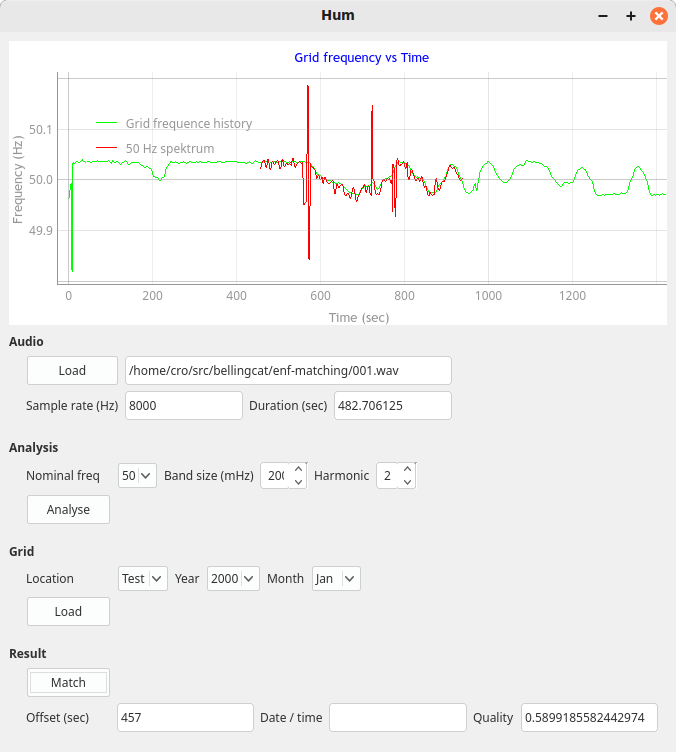

# ENF Matching

GUI application based on code from

The example code from my blog post about ENF matching: ["How to date a
recording using background electrical
noise"](https://robertheaton.com/enf). This script predicts when a target
recording was taken by comparing its background electrical noise to a
reference recording.


## Setup

```
virtualenv venv
source venv/bin/activate
pip3 install -r requirements.txt
```
Download sample files from https://github.com/ghuawhu/ENF-WHU-Dataset:
```
./bin/download-examnple-files
ffmpeg -ss 71000 -i 001_ref.wav -c copy 71000_ref.wav
```

## Run

To run the GUI version:

```
./hum.py
```

In oder to run the test case:

- Select the audio file to be analysed by pressing the 'Load' button in the
  *Audio* group; then select the file *001.wav*. The file will be loaded and
  sample rate and duration be shown in the fields below the button.

- One the file is loaded, it has to be processed to get the ENF values. For
  the test file *001.wav*, leave the settings *nominal grid frquency*,
  *frequency band size* and *harmonic* at their default values. Press
  *analyse*. A red curve will appear in the plot area, displaying the ENF
  values over time.

- Load the grid frequencies. Leave all settings at their default values and
  press the *Load* button in the *Grid* group. A green line will appear in the
  plot area, indicating the ENF values loaded from a hard-wired test file.

- Press the *Match* button.



To run the reference code from RH:

```
./main.py 001.wav -r 71000_ref.wav
```
Should output:

```
<snip>
True value is 71458
Best prediction is 460
```
