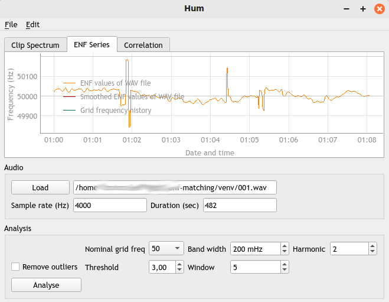
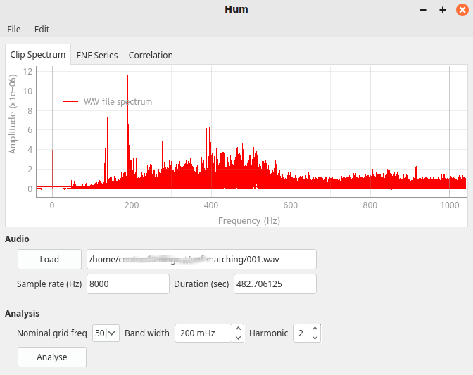
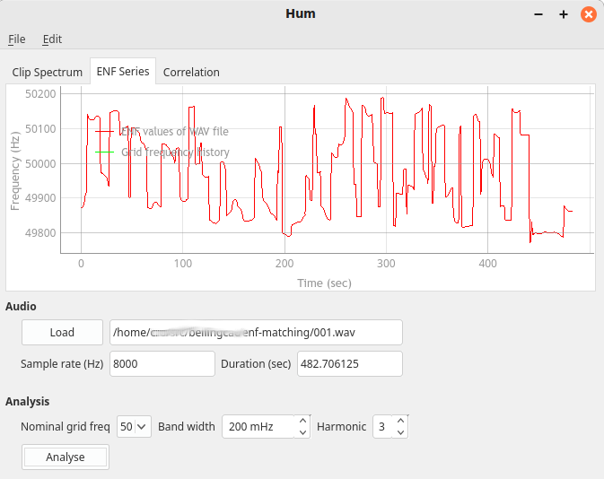
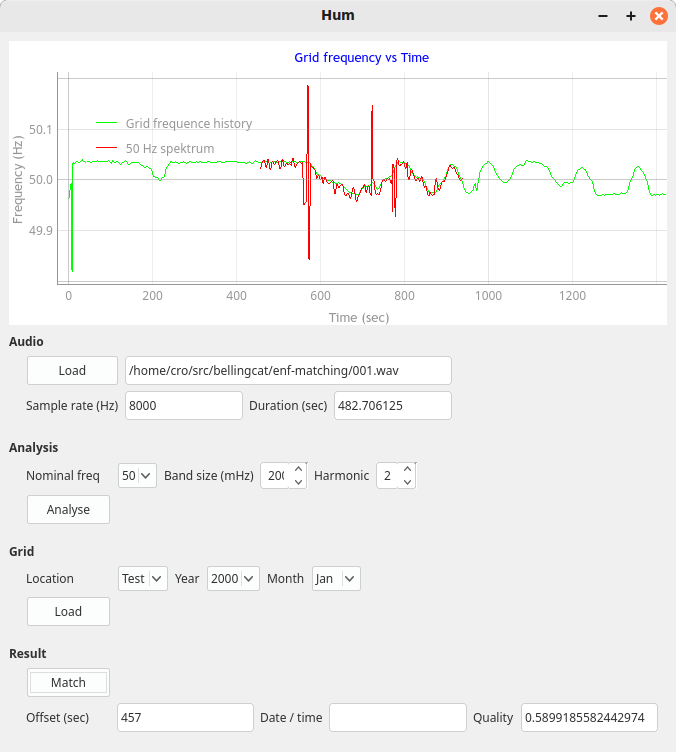

# Electrical Network Frequency Analysis

This repository contains two Python applications that attempt to check for the
presence of ENF signals in audio or video recordings and to match them against
ENF history provided by power grid operators.

The two applications `hum,py` and `flimmer.py` share a lot of code, and I may
later merge them into a single application.

## Analysis of Audio Clips: hum.py

GUI application that reuses tome of the signal processing from example code
from Robert Heaton on [github](https://github.com/robert/enf-matching).

### Run

To run the application:

```
python3 hum.py
```

In order to run the test case:

- Select the audio file to be analysed by pressing the 'Load' button in the
  *Audio* group; then select the file *001.wav*. The file will be loaded and
  sample rate and duration be shown in the fields below the button.

- Once the file is loaded, it has to be processed to get the ENF values. For
  the test file *001.wav*, leave the settings *nominal grid frquency*,
  *frequency band size* and *harmonic* at their default values. Press
  *analyse*. A red curve will appear in the plot area, displaying the ENF
  values over time.

  

  The screenshot shows that the 50 Hz component varies slowly albeit with some
  outliers.

  

  The plot shows the the clip spectrum.

  

  Here, a different harmonic has been chosen. No clear 50 Hz component is
  present in the diagram.

- Load the grid frequencies. Select *Test* as location and press the *Load*
  button in the *Grid* group. A blue line will appear in the plot area,
  indicating the ENF values loaded from a hard-wired test file.

- Leave the metric setting at *Euclidean* and press the *Match* button.

  

  The diagram shows a good match between the ENF pattern in the audio clip and
  the (test) grid ENF.

### Design Details

- `hum` uses `ffmpeg` to convert media files to the WAV format. The reduce
  memory requirements, the file is down sampled to 4000 Hz. `hum` loads the
  entire WAV file into memory; very long files may crash the application.

- Grid data are handled with a granularity of one month. The original reason
  was that operator provide the data as one file per month; `hum` also stores
  ENF data as one record per month in the SQL database.

  Up to 12 months ENF data can be used. This limit is set to limit memory
  usage and processing time.

- ENF data are typically provided as CSV files in a format like:

```
Timestamp, frequency
2019-04-01 00:00:00,50.001
2019-04-01 00:00:01,59.997
2019-04-01 00:00:02,59.998
```

  The timestamps are evenly spaced at 1 second (Fingrid 100 ms). `hum` assumes
  that timestamps start at 00:00:00 of a month and are contiguous without
  gaps.

  In reality, there are a few gaps so that the time match may be off by a few
  seconds.

### Status

Getting actual ENF values from grid operator is implemented for Great Britain
and Finland. Fingrid have recently changed their API, `hum` has not yet been
updated.

Once downloaded from the internet, the extracted ENF series are stored in an
sqlite database; its filename should be set in the *settings* dialog.

Input files are always fed into `ffmpeg` for conversion to a WAV file; at the
same time the sample rate is reduced to 4000 Hz. All file type supported by
`ffmpeg` are hence also supported by hum.

The matching process takes several minutes; its time complexity is (clip
duration in seconds * number of seconds in a the month). Currently, the
operation is single-threaded.

Error handling is only rudimentary. When the program runs out of memory, it
silently crashes. Catching `MemoryError`s does not work.

The application reproduces the test case outlined in
[github](https://github.com/robert/enf-matching). The original reference
file is very long, and my humble Linux notebook ran out of memory during the
signal processing. I had to shorted the reference file, see the call to ffmpeg
in https://github.com/CoRoe/enf-matching/blob/main/bin/download-example-files.

## Analysis of Video Clips: Flimmer.py

Flimmer offers two analysis modes: One for videos recorded with a camera that
has a *global shutter* and one for *rolling shutter* cameras. The mode has to
be chosen before actually loading the video clip.

The algorithm assumes that the video has been recorded with a rolling shutter
camera; this should be the case for most smartphone cameras. For details see
for instance
https://www.mdpi.com/2076-3417/13/8/5039. https://www.photometrics.com/learn/white-papers/rolling-vs-global-shutter
explains the difference between *rolling* and *global* shutter.

### Rolling Shutter

`flimmer.py` uses `ffmpeg` to transform a compressed video file into a raw
format with only the luminance component retained. The file contains one
byte per pixel, so -- for instance a video with 1080 x 1920 resolution there
are 2,073,600 bytes per video frame.

The rolling shutter mechanism introduces alias frequencies because the camera
frame rate (for instance 30 or 24 frames per second) combines with the grid
frequency (50 or 60 Hz) and their harmonics to form alias frequencies. The
interesting ones are in the range of several hundred Hertz.

The video signal is therefore down sampled to around 600 Hz in the following
way: The scan lines of a video frame (1080 for a full-HD camera) are grouped
into 20 *slices*, hence the vertical resolution is 20 per frame, and for 30
fps the the temporal resolution is 600 Hz.

However, the time to expose the sensor scan lines and the transfer to the
smartphone controller do not take exactly 1/30 second, there is a likely some
idle time after the transfer (see the Figure 4 in
https://www.mdpi.com/2076-3417/13/8/5039). Literature indicates that exposure
and data transfer take around 30 ms per frame, so there is a 3.3 ms idle time
until the start of the next frame.

To cater for this idle time, `flimmer.py` inserts some interpolated frames in
to luminance inout stream. This happens (in the current implementation) when
the application reads the output from `ffmpeg`; hence the size of the idle
period has to be known when loading the video. Because of the interpolated
idle frames, the effective sample rate is somewhat higher than 600 Hz.

The UI allows for setting the *readout time*, that is, the time the image
sensor needs for exposure and transfer to the CPU. It was chosen as parameter
because it more intuitive than e.g. the idle time.

After `flimmer.py` has converted the video stream into a time series of
luminance data, processing is similar to the processing of audio
recordings. The difference is that in the audio case, one has to check for the
grid frequency of harmonics thereof while in the video / rolling shutter case
the frequencies of interest are the alias frequencies grid frequency -- camera
frame rate.

### Global Shutter

In a camera with a global shutter, all pixels of the camera sensor are exposed
at the same time and then read out sequentially.

Flimmer attempts to look for the ENF signals in 'steady' image areas. This is
implemented as follows:

When reading a video file, `flimmer` divides each frame into rectangles of
equal size; the number of rows and columns can be set in the GUI. Default is a
grid of 10 x 10 rectangles. Assuming a resolution of 1080x1920, each rectangle
is 108 pixels high and 192 pixels wide. Flimmer computes for each rectangle of
the frame its average luminosity and appaned it to a time series.

So staying with the example of 10 x 10 rectangles (Regions of Interest, ROI),
there will be 100 video data streams. When the 'analysis' button is pressed,
flimmer choses the stream with the lowest variation and analyses it
further. The signal is passed through a notch filter that removes the frame
frequency and its harmonics. After that, a bandpass is applied and the signal
is processed using STFT.

Alias frequencies: Light bulbs an fluorescent lamps emit light during both the
positive and negative part of the grid sine wave; the basic frequency is thus
twice the grid frequency. The 'harmonic' setting in the GUI should therefore
be 2.

Assume a frame rate of 30 Hz (frames per second). This is the sample rate in
the *global shutter* mode. Because of the sampling process, alias frequencies
are introduced; their values are

$$n f_g + m f_s$$

where $n$ is the harmonic of the grid frequency, $f_g$ is the grid frequency,
$m$ is the harmonic of the frame rate, and $f_s$ is the frame rate. $n$ and
$m$ are small integer numbers.

An example: Grid frequency 50 Hz, harmonic 2, frame rate 30 fps, harmonic -3:
2 * 50 - 3 * 30 = 10.

### Usage

The usage is similar to that of `hum.py`: You work from top to bottom.

The following parameters have to be chosen:

| Parameter            | Meaning                                                                                       |
|----------------------|-----------------------------------------------------------------------------------------------|
| Sensor read-out time | Time in milliseconds to transfer pixel data from sensor ro CPU; 30 ms may be a starting point |
| # Grid rows          | Number of columns of rectangles                                                               |
| # Grid columns       | Number of rows of rectangles                                                                  |
| Grid freq            | Grid frequency in Hz                                                                          |
| Harmonic             | Harmonic of the grid frequency; usually 2                                                     |
| Vid. harmonic        | Harmonic of video frame rate; usually -3                                                      |
| Band width           | Bandwidth of the expected ENF signal                                                          |
| Alias freq           | Combination of frame frequency and grid frequency where the ENF signal is expected            |
| Notch filter qual.   | Quality of the notch filter that removes image content that cannot be ENF. 0 disables filter. |
|                      |                                                                                               |

### Status

Frequency changes in test video clip are recognised.

## Testing

There a some unit test cases for `griddata.py`. To run them:

```
pytest-3 test.py
```

## See also

https://robertheaton.com/enf/

https://github.com/bellingcat/open-questions/tree/main/electrical-network-frequency-analysis

Lumenera Corp., Exposure and Strobe Delay vs. Shutter Type Timing:
https://www.lumenera.com/media/wysiwyg/support/pdf/LA-2104-ExposureVsShutterTypeTimingAppNote.pdf
