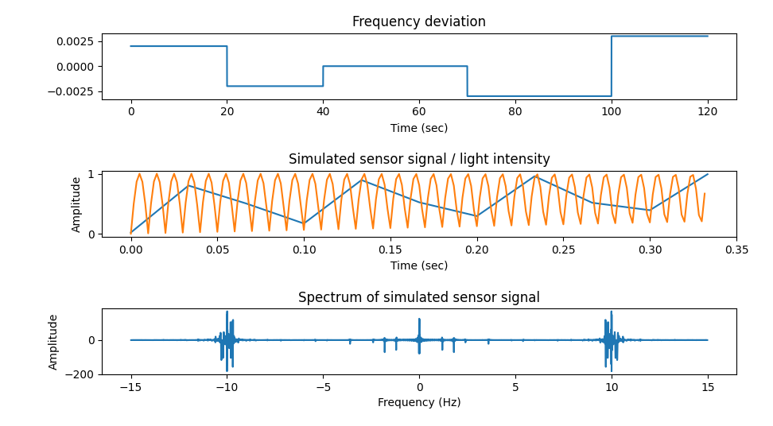

Just a number of scripts, mostly in *statu nascendi*.

# fm.py

Generates a video test file. The video signal mimics a light source whose
luminosity is proportional to the rectified current grid voltage recorded by a
camera with global shutter. The simulated grid voltage is slightly shifted to
simulate grid frequency changes.

The pattern of the frequency deviation is according to the following table:

```
    # Format: Duration (seconds), frequency deviation factor
    freq_deltas = (
        (20, +0.002),
        (20, -0.002),
        (30,  0.000),
        (30, -0.003),
        (20, +0.003)
    )
```

The idea is that the pattern should be recognisable when the video file
generated by `fm.py`is analysed by `flimmer`.

`ffmpeg` is able to overlay two videos. This feature can be used to create
test files for `flimmer`: Take an arbitrary video clip, mix it with a file
generated by `fm.py`, and check if `flimmer` is still able to detect the ENF
pattern.




## Limitations

- Files always have a duration of 120 seconds.

- Currently simulates only global shutter, not rolling shutter.

# rs_sim.py

The scripts simulates a mains-powered light source and the processing by CMOS
image sensor; CMOS sensors have the characteristic that scan lines are exposed
sequentially; so each row is exposed at a slightly different point in time.
The grid frequency and the frame rate interfere with each other.

The mechanism is called *rolling shutter* although no machanically moving
shutter is used.

The script simulates a system containing a light source and a sensor and plots
the simulated waveform and its spectrum.

# download.sh

Loads two files from YouTube and adds a synthesized ENF signal to it. The
files are placed in the ../samplemedia directory. Two versions are created
from each original vide: One with 10% ENF, one with 20% ENF.

The script assumes that

- ffmpeg is installed;

- a command to download files from YouTune ist installed.
